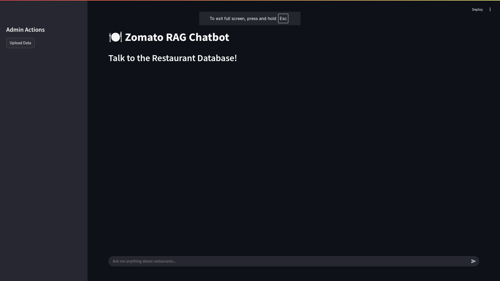
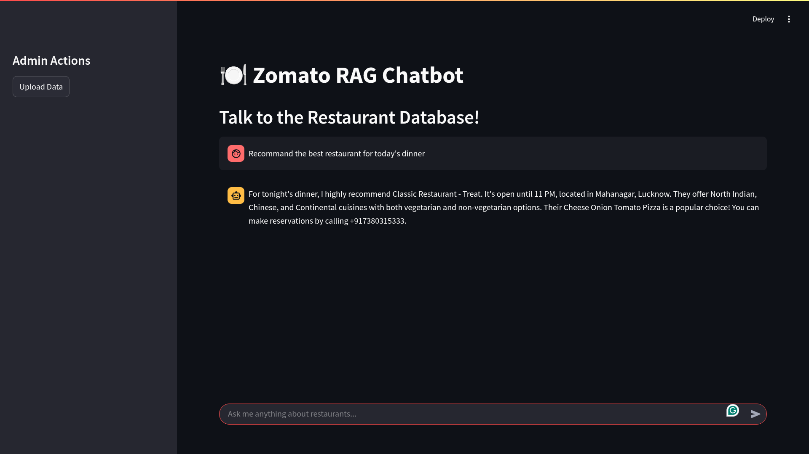
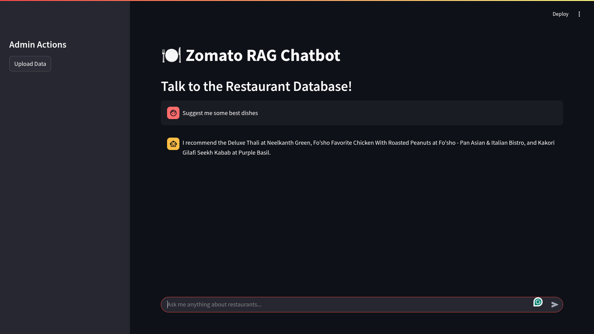
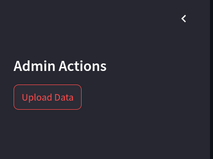

# HungryBot: Restaurant Data Scraper & RAG-based Chatbot 🍽️🤖

An intelligent restaurant recommendation system that combines web scraping, RAG (Retrieval Augmented Generation), and a conversational interface to provide personalized dining suggestions.

<div align="center">
  
[](https://www.python.org/downloads/)
[](https://www.mongodb.com/)
[](https://streamlit.io/)
[](LICENSE)
[](https://www.pinecone.io/)
[](https://deepmind.google/technologies/gemini/)
[](https://fastapi.tiangolo.com/)
[](https://playwright.dev/)
[](https://www.crummy.com/software/BeautifulSoup/)
[](https://motor.readthedocs.io/)

</div>

## 📑 Table of Contents
- [Demo & Screenshots](#-screenshots--demo)
- [Features](#-features)
- [System Architecture](#-system-architecture)
- [Technology Stack](#-technology-stack)
- [Getting Started](#-getting-started)
- [Technical Documentation](#-technical-documentation)
- [Contributing](#-contributing)
- [License](#-license)

## 📸 Screenshots & Demo

### UI Screenshots

#### Main Chat Interface

*The main chat interface where users can interact with the chatbot*

#### Restaurant Recommendations

*Example of restaurant recommendations with detailed information*

#### Menu Exploration

*Detailed menu view*

#### Upload Data

*Upload fresh data*

## 🌟 Features

### Web Scraping
- Automated scraping of restaurant data
- Extracts comprehensive restaurant information including:
  - Basic details (name, address, ratings, location)
  - Menu items with prices and categories
  - Dietary options (veg/non-veg)
  - Operating hours
  - Location data
  - Payment methods
  - Cuisine types

### Data Processing
- Intelligent menu categorization
- Price normalization and currency handling
- Smart duplicate detection and removal
- Structured data transformation for vector storage
- Dietary preference detection
- Address formatting and standardization

### RAG System
- Vector-based similarity search using Pinecone
- Hybrid search combining menu items and restaurant details
- Context-aware response generation
- Fallback handling for general queries
- Dynamic prompt generation based on query type

### Chat Interface
- Interactive Streamlit-based UI
- Real-time response generation
- Chat history maintenance
- Admin controls for data upload
- Loading state indicators
- Markdown formatting support

## 🏗 System Architecture

### High-Level Architecture
```
┌─────────────────┐     ┌─────────────────┐     ┌─────────────────┐
│   Web Scraper   │ ──► │  Data Pipeline  │ ──► │  Vector Store   │
└─────────────────┘     └─────────────────┘     └─────────────────┘
                                                         ▲
┌─────────────────┐     ┌─────────────────┐            │
│    Streamlit    │ ◄─► │   RAG Engine    │ ───────────┘
└─────────────────┘     └─────────────────┘
```

### Component Overview
1. **Web Scraper Layer**
   - Playwright for dynamic content
   - Async scraping for performance
   - Rate limiting and retry logic

2. **Data Pipeline**
   - MongoDB for structured storage
   - Data cleaning and normalization
   - Vector embedding generation

3. **RAG Engine**
   - Pinecone for vector similarity search
   - Google Gemini for text generation
   - Custom prompt engineering

4. **Frontend Layer**
   - Streamlit for UI rendering
   - WebSocket for real-time updates
   - Session management

## 🛠️ Technology Stack

### Core Technologies
- Python 3.8+
- MongoDB (with Motor for async operations)
- Pinecone Vector Database
- Google Gemini AI
- Streamlit

### Key Libraries
- FastAPI
- Playwright
- BeautifulSoup4
- Pydantic
- Motor (Async MongoDB)
- Google Generative AI
- Python-dotenv

## 📖 Technical Documentation

### Implementation Details

#### Data Flow
1. **Scraping Pipeline**
   ```python
   URL → Playwright → Raw HTML → BeautifulSoup → Structured Data → MongoDB
   ```

2. **Query Processing**
   ```python
   User Query → Vector Embedding → Similarity Search → Context Building → LLM → Response
   ```

#### Design Decisions

1. **Choice of Vector Store**
   - Pinecone selected for:
     - Low latency querying
     - Scalability
     - Simple integration
     - Cost-effectiveness

2. **Async Implementation**
   - Used async/await for:
     - Improved scraping performance
     - Better resource utilization
     - Enhanced UI responsiveness

3. **LLM Selection**
   - Google Gemini chosen for:
     - Superior context understanding
     - Cost-effective API
     - Reliable performance

### Challenges & Solutions

1. **Vector Search Accuracy**
   - Challenge: Imprecise restaurant and menu matching
   - Solution: Implemented hybrid search combining restaurant and menu item vectors in Pinecone

2. **Data Quality**
   - Challenge: Inconsistent restaurant data formats
   - Solution: Implemented Pydantic models with strict validation (`Restaurant` and `MenuItem` classes)

3. **Response Latency**
   - Challenge: Slow chat responses
   - Solution: Implemented async operations with Motor and optimized Gemini prompt generation

### Future Improvements

1. **AI/ML Enhancements**
   - Implement few-shot learning for better context understanding
   - Add sentiment analysis for restaurant review summarization
   - Develop personalized ranking algorithms using collaborative filtering
   - Integrate multimodal embeddings for image-text matching

2. **Advanced Features**
   - Real-time price prediction using time-series analysis
   - Cross-restaurant dish comparison using semantic similarity
   - Dynamic menu recommendations based on user dietary preferences
   - AR-based dish visualization using mobile camera integration

3. **System Architecture**
   - Implement event-driven architecture using Apache Kafka
   - Add vector database sharding for horizontal scaling
   - Deploy microservices using Kubernetes
   - Implement GraphQL API for flexible data querying

4. **User Experience**
   - Voice-based conversational interface
   - Location-aware contextual recommendations
   - Social features for sharing and group ordering
   - Progressive Web App (PWA) for offline capabilities

## 🚀 Getting Started

1. Clone the repository:
```bash
git clone <repository-url>
cd zomato-rag-chatbot
```

2. Create and activate virtual environment:
```bash
python -m venv venv
source venv/bin/activate  # On Windows: venv\Scripts\activate
```

3. Install dependencies:
```bash
pip install -r requirements.txt
```

4. Set up environment variables:
```bash
# Create .env file with:
MONGODB_URI=your_mongodb_uri
GEMINI_API_KEY=your_gemini_api_key
PINECONE_API_KEY=your_pinecone_api_key
```

5. Initialize the database:
```bash
python scraper/main.py  # Scrape initial data
python scraper/knowledge_base/build_kb.py  # Build knowledge base
```

6. Start the application:
```bash
cd rag
streamlit run main.py
```

## 🤝 Contributing

1. Fork the repository
2. Create your feature branch (`git checkout -b feature/AmazingFeature`)
3. Commit your changes (`git commit -m 'Add some AmazingFeature'`)
4. Push to the branch (`git push origin feature/AmazingFeature`)
5. Open a Pull Request

## 📝 License

This project is licensed under the MIT License - see the [LICENSE](LICENSE) file for details.

## 📞 Support

For support, email 7055ranamanish@gmail.com.
